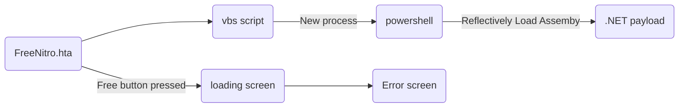
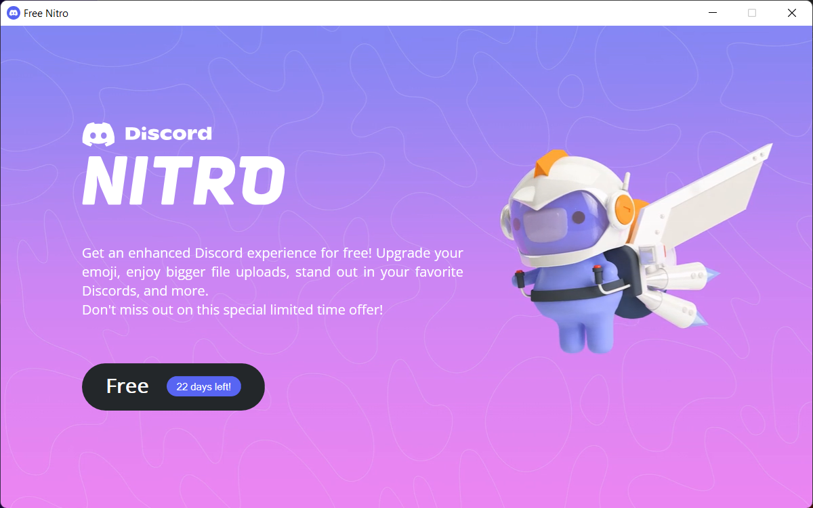

# Discord Worm

Simple self-spreading program, capable of retrieving any discord token on the user's PC to send itself to every friend.

### Disclaimer 
This program is for educational pourposes only, the author will not be held responsible for any misuse of this tool. Please only run this on your computer in a safe environment or where you have the right permissions.

### How this works
Everything is started by `FreeNitro.hta`, which is a fake free nitro page. The file has a vbs script that executes at launch and starts a new powershell process (so the rest of the program is able to run even if the first window is closed).
The powershell process then loads the .NET assembly payload and executes it from memory. The payload searches the local storage of the user's browsers and Discord in order to find authorization tokens. Once the tokens have been found the program retrieves the frendlist and sends itself to each friend along with a brief message.

### Screenshots

